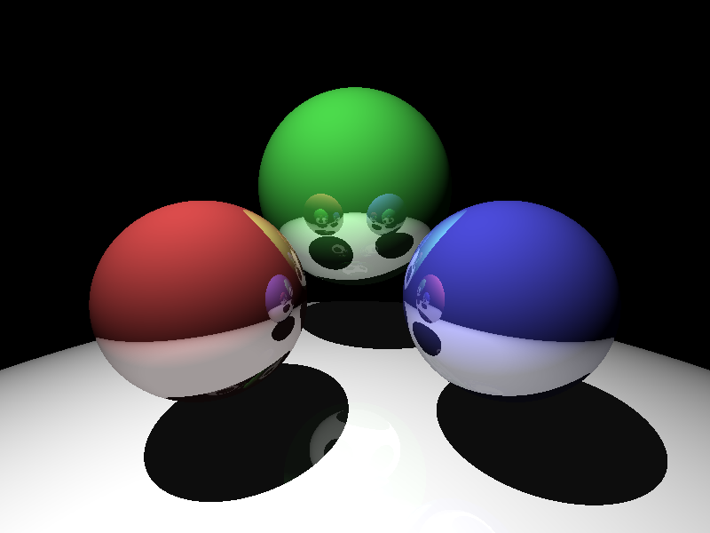

# Python Raytracer
This is a simple implementation of a raytracer algorithm in Python for study purposes. Enjoy!

## References

* https://gist.github.com/sevko/c3ed2430e96b89dd3177
* https://github.com/arocks/puray
* https://www.cs.unc.edu/~rademach/xroads-RT/RTarticle.html
* https://www.scratchapixel.com/